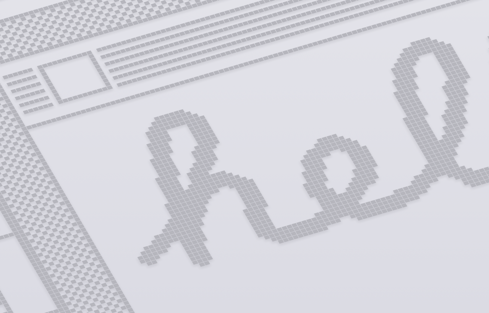

<div align="center">

# CodeSync

统一管理 **OpenCode · Codex · Claude Code** 的本地会话记录。

浏览 · 检索 · 预览 · 统计 · 备份 · 修复


</div>

---

## 概述

CodeSync 是一款本地优先的桌面应用，用于在一个界面中统一管理来自 **OpenCode**、**OpenAI Codex** 和 **Anthropic Claude Code** 的 AI 编程会话记录。

所有数据都在本地读取，不上传任何远端服务器。支持会话浏览、全文搜索、内容预览、统计分析、备份恢复与本地索引修复。

### 支持的 Provider

| Provider | 数据源 | 列表 / 搜索 | 预览 | 统计 | 备份 / 恢复 | 删除 | 修复 |
| --- | --- | :-: | :-: | :-: | :-: | :-: | :-: |
| **OpenCode** | `opencode.db` (SQLite) | ✅ | ✅ | ✅ | — | ✅ | — |
| **Codex** | `.codex/` (JSONL + SQLite) | ✅ | ✅ | ✅ | ✅ | ✅ | ✅ |
| **Claude Code** | `.claude/` (JSONL) | ✅ | ✅ | ✅ | ✅ | ✅ | ✅ |

> OpenCode 的高风险写入操作（备份/还原/修复）暂未开放，避免误改 SQLite 数据库。

---

## 功能

- **三源会话管理** — 在侧栏一键切换 OpenCode / Codex / Claude Code，各自独立浏览。
- **智能搜索** — 按 ID、标题、首条消息、工作目录全文检索。
- **会话预览** — 区分用户消息、助手消息、推理过程、工具调用与工具返回，支持分页加载。
- **多维统计** — 会话总量、Token 消耗、时间趋势、项目分布、模型占比、热力图。
- **备份与恢复** — 单条或批量备份 Codex / Claude 会话，支持会话包导入导出。
- **索引修复** — 重建 Codex `session_index.jsonl` / `threads` 表，清理 orphan 记录，修复 Claude GUI 可见性。
- **Provider 分支管理** — Codex 会话支持 provider 切换同步、从稳定节点创建回溯分支。
- **跨平台** — macOS / Windows / Linux 全平台支持，CLI 版本适配 WSL 和无桌面环境。

---

## 界面预览



采用极简瑞士平面设计风格：零圆角、扁平列表、等宽元数据、大量留白。

---

## 快捷键

| 场景 | 快捷键 | 作用 |
| --- | --- | --- |
| 全局 | <kbd>Ctrl</kbd> / <kbd>Cmd</kbd> + <kbd>K</kbd> | 聚焦搜索框 |
| 全局 | <kbd>Ctrl</kbd> / <kbd>Cmd</kbd> + <kbd>Shift</kbd> + <kbd>L</kbd> | 切换明暗主题 |
| 会话列表 | <kbd>Delete</kbd> / <kbd>Backspace</kbd> | 删除已选会话 |
| 会话预览 | <kbd>Home</kbd> / <kbd>End</kbd> | 滚动到顶部 / 底部 |
| 会话预览 | <kbd>Page Up</kbd> / <kbd>Page Down</kbd> | 翻页并自动加载更多 |

---

## 快速开始

### 开发环境

前置依赖：Node.js 20+、npm、Rust stable、Tauri 2 构建依赖。

```bash
# 安装依赖
npm ci

# 启动开发模式
npm run tauri:dev

# 构建桌面应用
npm run tauri:build
```

构建产物位于 `src-tauri/target/release/bundle/`。

### 默认数据路径

| Provider | 默认路径 | 环境变量 |
| --- | --- | --- |
| OpenCode | `~/.local/share/opencode/opencode.db` (macOS/Linux)<br>`%LOCALAPPDATA%\opencode\opencode.db` (Windows) | `OPENCODE_DB` |
| Codex | `~/.codex/` | — |
| Claude Code | `~/.claude/` | — |

可在设置弹窗中自定义路径。

---

## CLI 版本

仓库同时提供无桌面 CLI `codesync-cli`，关闭 Tauri `desktop` feature，适合 WSL、服务器或 SSH 环境。

```bash
# 构建
npm run cli:build

# 运行交互菜单（推荐）
npm run cli:run

# 或直接使用子命令
codesync-cli --provider opencode list --limit 20
codesync-cli --provider claude search "关键词"
codesync-cli --provider opencode stats kpi
codesync-cli preview ~/.codex/sessions/.../rollout-xxx.jsonl --mode all
codesync-cli webui --host 127.0.0.1 --port 17888
```

### Web UI 模式

无桌面环境可启动内置 Web UI，浏览器访问完整功能：

```bash
codesync-cli --provider opencode webui --host 127.0.0.1 --port 17888
```

启动时生成一次性 API token，注入到 Web 页面，后续请求需携带该 token。

---

## 发布

版本号在以下三处保持一致：

- `package.json`
- `src-tauri/Cargo.toml`
- `src-tauri/tauri.conf.json`

推送 `v*.*.*` 格式的 tag 触发 GitHub Actions 自动打包三平台 Release：

```bash
git tag -a v0.4.0 -m "v0.4.0"
git push origin v0.4.0
```

### macOS 提示

从 Release 下载的应用可能被 Gatekeeper 拦截：

```bash
xattr -dr com.apple.quarantine "/Applications/CodeSync.app"
```

---

## 技术栈

| 层 | 技术 |
| --- | --- |
| 桌面框架 | Tauri 2 |
| 前端 | React 18 · TypeScript · Tailwind CSS · Radix UI |
| 后端 | Rust · rusqlite · serde |
| 构建 | Vite 6 · Cargo |
| 图表 | Recharts |
| 状态 | Zustand |

---

## 致谢

本项目基于以下开源项目二次开发，在此深表感谢：

- **[cc-sessions](https://github.com/ccpopy/cc-sessions)** by [@ccpopy](https://github.com/ccpopy) — 本项目的上游，提供了 Codex / Claude Code 会话管理、修复、备份迁移的完整基础。
- **[codex-session-cloner](https://github.com/goodnightzsj/codex-session-cloner)** by [@goodnightzsj](https://github.com/goodnightzsj) — 参考了修复和会话导出导入的实现思路。
- **[linux.do](https://linux.do)** — 真诚、友善、团结、专业，共建你我引以为荣之社区。

OpenCode、OpenAI、Anthropic Claude 的名称和 Logo 归各自公司所有，本项目仅用于本地数据管理，不与这些公司有任何关联。

---

## License

[MIT](LICENSE)
